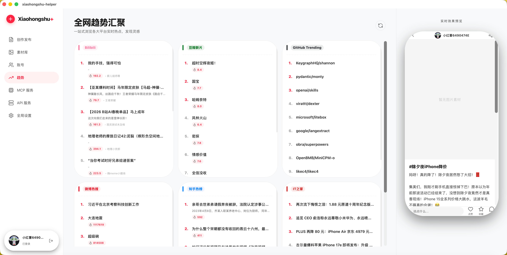

# Tauri + React + Typescript

This template should help get you started developing with Tauri, React and Typescript in Vite.

## Recommended IDE Setup

- [VS Code](https://code.visualstudio.com/) + [Tauri](https://marketplace.visualstudio.com/items?itemName=tauri-apps.tauri-vscode) + [rust-analyzer](https://marketplace.visualstudio.com/items?itemName=rust-lang.rust-analyzer)


## 运行程序
下载源码,安装 rust,node,然后运行
```bash
npm run tauri dev
```


## 截图展示

| | |
| :---: | :---: |
| **启动界面** <br>  | **趋势首页** <br>  |
| **AI 生成内容** <br>  | **AI 润色标题** <br>  |
| **AI 生成封面图** <br>  | **智能蹭热点** <br>  |
| **账号管理** <br>  | **素材库** <br>  |
| **设置中心** <br>  | **添加 AI 模型** <br>  |
| **添加提示词** <br>  | **配置数据分析 AI** <br>  |
| **MCP 首页** <br>  | **API 端点服务** <br>  |
